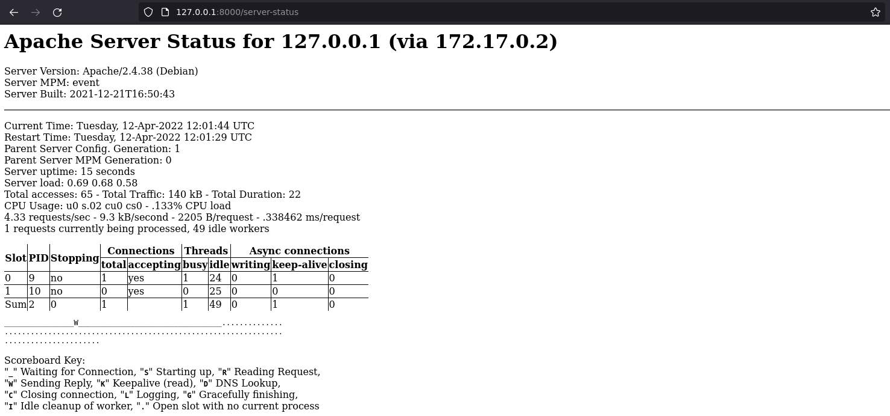
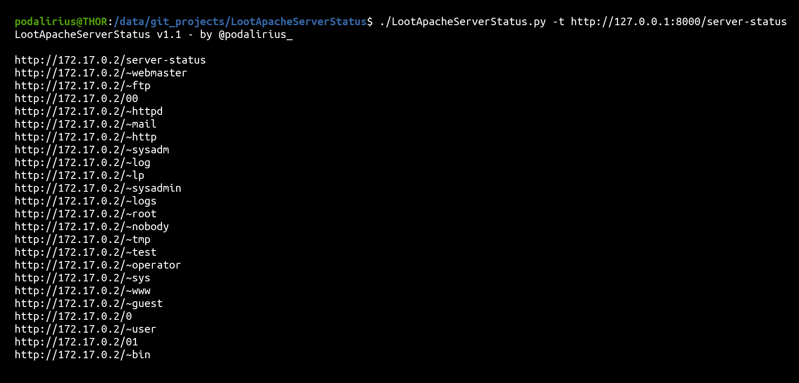

<p align="center">
    A script to automatically dump all URLs present in /server-status to a file locally.
    <br>
    
    <a href="https://twitter.com/intent/follow?screen_name=podalirius_" title="Follow"></a>
    <a href="https://www.youtube.com/c/Podalirius_?sub_confirmation=1" title="Subscribe"></a>
    <br>
</p>

## Features

 - [x] Automatically parses the URLs present in Apache Server Status.
 - [x] Export all URLs to a file.

## Usage

```
$ ./LootApacheServerStatus.py -h
LootApacheServerStatus v1.1 - by @podalirius_

usage: LootApacheServerStatus.py [-h] -t TARGET [-l LOGFILE] [-v] [-k]

A script to automatically dump all URLs present in /server-status to a file locally.

optional arguments:
  -h, --help            show this help message and exit
  -t TARGET, --target TARGET
                        URL of the Apache server-status to connect to.
  -l LOGFILE, --logfile LOGFILE
                        Output URLs to specified logfile.
  -v, --verbose         Verbose mode. (default: False)
  -k, --insecure        Allow insecure server connections when using SSL (default: False)
```

## Example

If you have access to the Apache Server Status:



You can use this tool to list all URLs:



## Contributions

Pull requests are welcome. Feel free to open an issue if you want to add other features.
